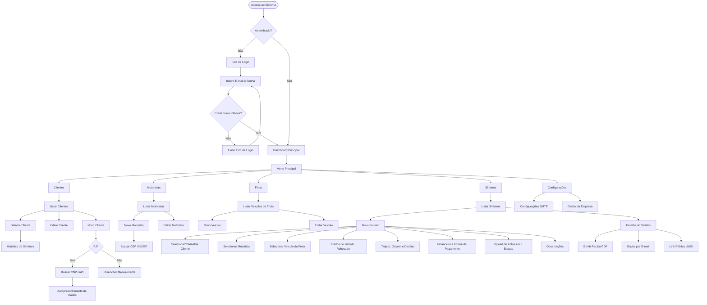
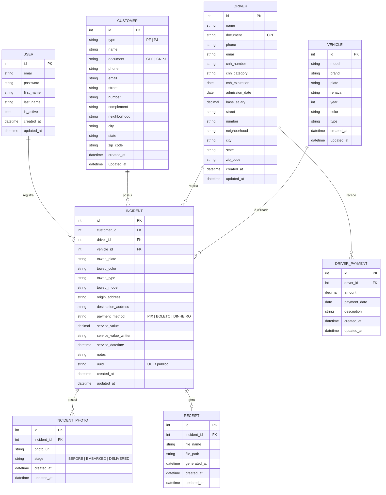

## 1. Visão Geral

O **SGR (Sistema de Gestão de Reboque)** é uma aplicação web interna, desenvolvida sob arquitetura Django Full Stack, com foco na operacionalização, otimização e gestão de serviços de reboque e sinistros. A plataforma centraliza o cadastro de clientes, motoristas e frota, automatiza a emissão de recibos fiscais em PDF e o envio por e-mail, e oferece uma interface responsiva e moderna para uso tanto no escritório quanto em campo (mobile).

---

## 2. Sobre o Produto

### 2.1 Propósito

Centralizar a operação de gestão de reboques, eliminando processos manuais baseados em papel. O sistema visa:

- Padronizar a comunicação visual com seguradoras, oficinas e clientes particulares.
- Agilizar o faturamento através da geração e envio automático de documentos (PDF + e-mail).
- Garantir rastreabilidade completa de cada serviço prestado, vinculado a cliente, motorista e veículo.

### 2.2 Público-Alvo

|Perfil|Descrição|
|---|---|
|**Operacional (Motoristas)**|Acesso rápido e otimizado via mobile para checagem de dados, rotas e envio de fotos dos serviços.|
|**Administrativo (BackOffice)**|Controle total sobre emissão de recibos, gestão financeira e cadastros gerais (motoristas, veículos e clientes).|

### 2.3 Diferenciais

- **Automação de Documentos:** Geração de PDFs com assinatura digital pré-inserida e conversão automática de valores numéricos para extenso.
- **Identidade Visual Premium:** Design moderno, limpo e consistente com tipografia, ícones, paleta de cores e favicon próprios.
- **Gestão Integrada e Rastreável:** Cada serviço é obrigatoriamente vinculado a um Cliente, Motorista e Veículo, garantindo histórico preciso.
- **Acesso Externo sem Login:** Recibos acessíveis via link público com UUID para o cliente final.

---

## 3. Objetivos

1. Eliminar o uso de papel e processos manuais na operação de reboque.
2. Reduzir o tempo de emissão de recibos de horas para segundos.
3. Centralizar o cadastro e histórico de clientes, motoristas e frota.
4. Garantir rastreabilidade completa de cada sinistro/serviço prestado.
5. Oferecer interface responsiva (Mobile First) para uso em campo pelos motoristas.
6. Padronizar a comunicação com clientes via e-mail automatizado com PDF anexo.

---

## 4. Requisitos Funcionais

### RF01 — Autenticação e Segurança

- Login via e-mail e senha (substituindo o `username` padrão do Django).
- Redirecionamento forçado para tela de Login para usuários não autenticados.
- Após autenticação, redirecionamento automático para o Dashboard principal.
- Logout disponível em todas as telas via menu de navegação.

### RF02 — Gestão de Clientes

- Cadastro, edição, listagem e detalhe de clientes (Pessoa Física e Pessoa Jurídica).
- Para clientes PJ: integração com API de CNPJ para autopreenchimento de dados.
- Cadastro de endereço como campo opcional.
- Histórico de sinistros vinculados ao cliente na tela de detalhe.
- Integração com API ViaCEP para autopreenchimento de endereço via CEP.

### RF03 — Gestão de Motoristas (RH)

- Cadastro completo com: informações pessoais, CNH, data de admissão, salário base e histórico de pagamentos.
- Integração com API ViaCEP para autopreenchimento de endereço via CEP.
- Listagem, edição e detalhe de motoristas.

### RF04 — Gestão de Frota

- Cadastro e controle de veículos da empresa (caminhões/reboques).
- Campos obrigatórios: Modelo, Placa, RENAVAM, Ano, e demais informações relevantes.
- Listagem, edição e detalhe de veículos.

### RF05 — Gestão de Sinistros (Serviços)

- Módulo central (Core) para registro de acionamentos de reboque.
- **Vinculações:** Cliente (com atalho para cadastro rápido inline), Motorista responsável e Veículo da frota.
- **Dados do veículo rebocado:** Placa, cor, tipo/categoria e demais informações relevantes.
- **Dados de Trajeto:** Origem e Destino com registro detalhado.
- **Financeiro:** Forma de pagamento (Pix, Boleto, Dinheiro) e conversão automática do valor para extenso.
- **Mídia (Fotos):** Upload em 3 etapas obrigatórias:
    
    1. Veículo antes do reboque.
    2. Veículo embarcado no reboque.
    3. Veículo descarregado no destino final.
    
    - Armazenamento via MinIO (Docker) localmente; futuramente S3.
- **Metadados:** Campo de observações livres, registro automático de Data/Hora do serviço e Data/Hora de inserção no sistema.

### RF06 — Emissão de Recibo (PDF)

- Layout A4 padronizado com cabeçalho/rodapé com dados da empresa.
- Box de totais em Split View para economia de espaço.
- Inserção automática da assinatura digital do responsável.
- Nomenclatura do arquivo: `Recibo-[NomeDaEmpresa]-[PlacaDoVeiculo]-[Data].pdf`.
- Visualização pública via link com UUID (sem necessidade de login).
- Conversão automática do valor numérico para extenso no documento.

### RF07 — Comunicação por E-mail

- Botão "Envio Rápido" na tela de detalhes do sinistro.
- Disparo de e-mail em HTML personalizado com logo e resumo do serviço.
- PDF gerado anexado ao e-mail automaticamente.
- Assunto e cabeçalho padronizados com a data do serviço.
- Configuração de credenciais SMTP via painel de configurações do sistema (variáveis de ambiente).

### RF08 — Integração WhatsApp _(Roadmap/Futuro)_

- Integração com Evolution API para disparo do recibo PDF (ou link UUID) via WhatsApp do cliente.

### RF09 — Configurações via Variáveis de Ambiente

- Todas as informações críticas do sistema devem ser configuradas via arquivo `.env`.
- Inclui: credenciais SMTP, chaves secretas, dados da empresa para emissão de recibos, configurações de storage, etc.

---

## 5. Fluxograma UX (Mermaid)



---

## 6. Requisitos Não-Funcionais

|Código|Requisito|
|---|---|
|**RNF01**|Interface construída com **TailwindCSS**, responsiva (Mobile First), aplicando estritamente a paleta de cores do Design System.|
|**RNF02**|Back-end em **Python 3.12+** com framework **Django 5.x**.|
|**RNF03**|Banco de dados **SQLite3** (escopo inicial), preparado para migração futura ao PostgreSQL.|
|**RNF04**|Código-fonte e variáveis em **Inglês**. Aderência à **PEP8** e uso de docstrings para classes e métodos.|
|**RNF05**|Interface, mensagens de erro e documentos gerados em **Português Brasileiro (pt-BR)**.|
|**RNF06**|Uso de **Class Based Views** sempre que possível.|
|**RNF07**|Toda model deve possuir os campos `created_at` e `updated_at`.|
|**RNF08**|Signals devem ficar em arquivo `signals.py` dentro do respectivo app.|
|**RNF09**|Templates organizados em pasta `templates/` na raiz do projeto.|
|**RNF10**|Código simples, sem over engineering. Aspas simples em todo o código Python.|
|**RNF11**|Todas as configurações críticas via arquivo `.env`.|

---

## 7. Arquitetura Técnica

### 7.1 Stack

|Camada|Tecnologia|
|---|---|
|**Linguagem**|Python 3.12+|
|**Framework Web**|Django 5.x|
|**Frontend**|Django Template Language + TailwindCSS (via CDN ou build)|
|**Banco de Dados**|SQLite3 (inicial) → PostgreSQL (futuro)|
|**Storage de Mídia**|MinIO (Docker, local) → AWS S3 (futuro)|
|**Geração de PDF**|ReportLab ou WeasyPrint|
|**E-mail**|Django `send_mail` + SMTP configurável via `.env`|
|**Autenticação**|Sistema nativo do Django (customizado para e-mail)|
|**API Externa CNPJ**|ReceitaWS ou BrasilAPI|
|**API ViaCEP**|viacep.com.br|
|**Variáveis de Ambiente**|`python-decouple` ou `django-environ`|

### 7.2 Estrutura de Apps Django

```
sgr/                        ← Projeto Django (settings, urls, wsgi)
├── accounts/               ← Autenticação customizada (login por e-mail)
├── customers/              ← Gestão de Clientes (RF02)
├── drivers/                ← Gestão de Motoristas (RF03)
├── fleet/                  ← Gestão de Frota (RF04)
├── incidents/              ← Gestão de Sinistros (RF05)
├── receipts/               ← Emissão de Recibos PDF (RF06)
├── notifications/          ← Envio de E-mails (RF07)
├── core/                   ← Mixins, helpers, base templates
└── templates/              ← Todos os templates HTML (raiz do projeto)
```

### 7.3 Estrutura de Dados (Mermaid ERD)



---

## 8. Design System

### 8.1 Paleta de Cores

|Token|Hexadecimal|Uso|
|---|---|---|
|`navy-primary`|`#1a2c42`|Sidebar, cabeçalhos, texto principal|
|`navy-light`|`#264060`|Hover states, elementos secundários de navegação|
|`coral-primary`|`#e85d36`|Botões de ação principal (CTAs), destaques e ícones|
|`coral-light`|`#ed7d5e`|Hover de botões de ação e links em destaque|
|`coral-dark`|`#d64821`|Active states (botões clicados)|
|`bg-app`|`#f8f9fb`|Fundo geral da aplicação (Cinza Gelo)|
|`card-bg`|`#ffffff`|Fundo de cards, modais e containers|
|`text-muted`|`#6b7280`|Legendas, placeholders e textos secundários|

### 8.2 Tipografia

- **Família:** `Poppins` (Google Fonts)
- **Pesos utilizados:** 300 (Light), 400 (Regular), 500 (Medium), 600 (SemiBold), 700 (Bold)
- **Importação no base template:**

```html
<link rel="preconnect" href="https://fonts.googleapis.com">
<link href="https://fonts.googleapis.com/css2?family=Poppins:wght@300;400;500;600;700&display=swap" rel="stylesheet">
```

- **Aplicação via Tailwind:**

```html
<style>
  body { font-family: 'Poppins', sans-serif; }
</style>
```

### 8.3 Configuração do Tailwind (CDN + Customização)

```html
<script>
  tailwind.config = {
    theme: {
      extend: {
        colors: {
          'navy': {
            'primary': '#1a2c42',
            'light': '#264060',
          },
          'coral': {
            'primary': '#e85d36',
            'light': '#ed7d5e',
            'dark': '#d64821',
          },
          'app': {
            'bg': '#f8f9fb',
            'card': '#ffffff',
            'muted': '#6b7280',
          }
        },
        fontFamily: {
          'sans': ['Poppins', 'sans-serif'],
        }
      }
    }
  }
</script>
```

### 8.4 Layout Base

**Estrutura de Layout (sidebar + conteúdo):**

```html
<body class="bg-[#f8f9fb] font-sans">
  <!-- Sidebar -->
  <aside class="fixed inset-y-0 left-0 w-64 bg-[#1a2c42] text-white flex flex-col z-50">
    <!-- Logo -->
    <div class="px-6 py-5 border-b border-[#264060]">
      <span class="text-xl font-bold text-white tracking-wide">SGR</span>
    </div>
    <!-- Nav Items -->
    <nav class="flex-1 px-3 py-4 space-y-1">
      <a href="#" class="flex items-center gap-3 px-3 py-2.5 rounded-lg text-sm font-medium
                         text-white/70 hover:bg-[#264060] hover:text-white transition-all">
        <!-- ícone + label -->
      </a>
      <!-- item ativo -->
      <a href="#" class="flex items-center gap-3 px-3 py-2.5 rounded-lg text-sm font-medium
                         bg-[#e85d36] text-white">
        <!-- ícone + label -->
      </a>
    </nav>
  </aside>

  <!-- Conteúdo Principal -->
  <main class="ml-64 min-h-screen">
    <!-- Topbar -->
    <header class="bg-white border-b border-gray-200 px-6 py-4 flex items-center justify-between">
      <h1 class="text-lg font-semibold text-[#1a2c42]">Título da Página</h1>
    </header>
    <!-- Área de conteúdo -->
    <div class="p-6">
      <!-- página aqui -->
    </div>
  </main>
</body>
```

### 8.5 Cards

```html
<div class="bg-white rounded-xl shadow-sm border border-gray-100 p-6">
  <h2 class="text-base font-semibold text-[#1a2c42] mb-4">Título do Card</h2>
  <!-- conteúdo -->
</div>
```

### 8.6 Botões

```html
<!-- Botão Primário (CTA) -->
<button class="inline-flex items-center gap-2 px-4 py-2.5 bg-[#e85d36] hover:bg-[#ed7d5e]
               active:bg-[#d64821] text-white text-sm font-medium rounded-lg transition-colors">
  Ação Principal
</button>

<!-- Botão Secundário -->
<button class="inline-flex items-center gap-2 px-4 py-2.5 bg-white hover:bg-gray-50
               border border-gray-200 text-[#1a2c42] text-sm font-medium rounded-lg transition-colors">
  Ação Secundária
</button>

<!-- Botão Perigo -->
<button class="inline-flex items-center gap-2 px-4 py-2.5 bg-red-600 hover:bg-red-700
               text-white text-sm font-medium rounded-lg transition-colors">
  Excluir
</button>
```

### 8.7 Inputs e Formulários

```html
<!-- Label + Input padrão -->
<div class="space-y-1.5">
  <label class="block text-sm font-medium text-[#1a2c42]">Nome completo</label>
  <input type="text"
         class="w-full px-3 py-2.5 text-sm bg-white border border-gray-200 rounded-lg
                text-[#1a2c42] placeholder-[#6b7280]
                focus:outline-none focus:ring-2 focus:ring-[#e85d36]/30 focus:border-[#e85d36]
                transition-colors"
         placeholder="Digite o nome">
</div>

<!-- Select -->
<div class="space-y-1.5">
  <label class="block text-sm font-medium text-[#1a2c42]">Forma de Pagamento</label>
  <select class="w-full px-3 py-2.5 text-sm bg-white border border-gray-200 rounded-lg
                 text-[#1a2c42] focus:outline-none focus:ring-2 focus:ring-[#e85d36]/30
                 focus:border-[#e85d36] transition-colors">
    <option value="">Selecione...</option>
  </select>
</div>

<!-- Textarea -->
<div class="space-y-1.5">
  <label class="block text-sm font-medium text-[#1a2c42]">Observações</label>
  <textarea rows="3"
            class="w-full px-3 py-2.5 text-sm bg-white border border-gray-200 rounded-lg
                   text-[#1a2c42] placeholder-[#6b7280] resize-none
                   focus:outline-none focus:ring-2 focus:ring-[#e85d36]/30 focus:border-[#e85d36]
                   transition-colors"></textarea>
</div>

<!-- Mensagem de erro de campo -->
<p class="text-xs text-red-500 mt-1">Este campo é obrigatório.</p>
```

### 8.8 Tabelas (Listagens)

```html
<div class="bg-white rounded-xl shadow-sm border border-gray-100 overflow-hidden">
  <table class="min-w-full divide-y divide-gray-100">
    <thead class="bg-[#f8f9fb]">
      <tr>
        <th class="px-4 py-3 text-left text-xs font-semibold text-[#6b7280] uppercase tracking-wider">
          Coluna
        </th>
      </tr>
    </thead>
    <tbody class="divide-y divide-gray-100">
      <tr class="hover:bg-gray-50 transition-colors">
        <td class="px-4 py-3.5 text-sm text-[#1a2c42]">Valor</td>
      </tr>
    </tbody>
  </table>
</div>
```

### 8.9 Badges de Status

```html
<!-- Verde: Concluído -->
<span class="inline-flex items-center px-2.5 py-0.5 rounded-full text-xs font-medium
             bg-green-100 text-green-800">Concluído</span>

<!-- Amarelo: Em Andamento -->
<span class="inline-flex items-center px-2.5 py-0.5 rounded-full text-xs font-medium
             bg-yellow-100 text-yellow-800">Em Andamento</span>

<!-- Vermelho: Cancelado -->
<span class="inline-flex items-center px-2.5 py-0.5 rounded-full text-xs font-medium
             bg-red-100 text-red-800">Cancelado</span>

<!-- Coral: Pendente -->
<span class="inline-flex items-center px-2.5 py-0.5 rounded-full text-xs font-medium
             bg-[#e85d36]/10 text-[#e85d36]">Pendente</span>
```

### 8.10 Mensagens de Feedback (Django Messages)

```html

  
    <div class="px-4 py-3 rounded-lg text-sm font-medium mb-4
                bg-green-50 text-green-800 border border-green-200
                bg-red-50 text-red-800 border border-red-200
                bg-yellow-50 text-yellow-800 border border-yellow-200
                bg-blue-50 text-blue-800 border border-blue-200">
      {{ message }}
    </div>
  

```

### 8.11 Responsividade

- **Mobile First:** estrutura de grid com `grid-cols-1 md:grid-cols-2 lg:grid-cols-3`.
- **Sidebar mobile:** ocultada em telas pequenas com toggle via JavaScript simples.
- **Topbar mobile:** exibe botão hamburguer para abrir/fechar sidebar.

---

## 9. User Stories

### Épico 1 — Autenticação

**US01 — Login via E-mail**

> Como colaborador, quero fazer login com meu e-mail e senha, para acessar o sistema de forma segura.

**Critérios de Aceite:**

- [ ] O campo de login aceita e-mail em vez de username.
- [ ] Credenciais inválidas exibem mensagem de erro em português.
- [ ] Após login bem-sucedido, o usuário é redirecionado ao Dashboard.
- [ ] Usuário não autenticado é redirecionado para a tela de Login.

---

### Épico 2 — Gestão de Clientes

**US02 — Cadastrar Cliente PF**

> Como backoffice, quero cadastrar um cliente pessoa física, para registrar serviços em seu nome.

**Critérios de Aceite:**

- [ ] Formulário com campos: nome, CPF, telefone, e-mail, endereço (opcional).
- [ ] CPF com validação de formato.
- [ ] Autopreenchimento de endereço via ViaCEP ao digitar o CEP.
- [ ] Mensagem de sucesso após salvar.

**US03 — Cadastrar Cliente PJ**

> Como backoffice, quero cadastrar um cliente pessoa jurídica com autopreenchimento via CNPJ.

**Critérios de Aceite:**

- [ ] Ao inserir o CNPJ, os dados da empresa são buscados via API e preenchidos automaticamente.
- [ ] Campos preenchidos são editáveis antes de salvar.
- [ ] Dados obrigatórios: razão social, CNPJ, telefone, e-mail.

**US04 — Visualizar Histórico do Cliente**

> Como backoffice, quero ver o histórico de sinistros de um cliente, para consultar serviços anteriores.

**Critérios de Aceite:**

- [ ] Na tela de detalhe do cliente, exibe lista de sinistros vinculados.
- [ ] Cada item da lista tem link para o detalhe do sinistro.

---

### Épico 3 — Gestão de Motoristas

**US05 — Cadastrar Motorista**

> Como backoffice, quero cadastrar um motorista com todos os seus dados, para vinculá-lo a sinistros.

**Critérios de Aceite:**

- [ ] Formulário com: nome, CPF, telefone, e-mail, CNH (número, categoria, validade), data de admissão, salário base.
- [ ] Autopreenchimento de endereço via ViaCEP.
- [ ] Histórico de pagamentos acessível na tela de detalhe.

---

### Épico 4 — Gestão de Frota

**US06 — Cadastrar Veículo da Frota**

> Como backoffice, quero cadastrar veículos da empresa, para vinculá-los aos sinistros realizados.

**Critérios de Aceite:**

- [ ] Formulário com: modelo, marca, placa, RENAVAM, ano, cor, tipo.
- [ ] Placa com validação de formato.
- [ ] Listagem com busca por placa e modelo.

---

### Épico 5 — Gestão de Sinistros

**US07 — Registrar Sinistro**

> Como operador, quero registrar um novo sinistro vinculado a cliente, motorista e veículo, para documentar o serviço prestado.

**Critérios de Aceite:**

- [ ] Seleção de cliente existente ou cadastro inline de novo cliente.
- [ ] Seleção de motorista e veículo da frota obrigatórios.
- [ ] Preenchimento dos dados do veículo rebocado (placa, cor, tipo, modelo).
- [ ] Dados de origem e destino obrigatórios.
- [ ] Seleção de forma de pagamento e valor do serviço.
- [ ] Valor convertido para extenso automaticamente.
- [ ] Data/hora do serviço registrada automaticamente.

**US08 — Upload de Fotos em 3 Etapas**

> Como motorista, quero fazer upload das fotos do serviço nas 3 etapas obrigatórias, para documentar visualmente o reboque.

**Critérios de Aceite:**

- [ ] Interface de upload separada por etapas: Antes, Embarcado, Entregue.
- [ ] Validação de que pelo menos uma foto foi enviada por etapa.
- [ ] Fotos armazenadas no MinIO.

---

### Épico 6 — Recibo PDF

**US09 — Emitir Recibo PDF**

> Como backoffice, quero gerar o recibo em PDF do sinistro, para enviar ao cliente como comprovante.

**Critérios de Aceite:**

- [ ] PDF gerado com layout A4 padronizado.
- [ ] Nome do arquivo: `Recibo-[Empresa]-[Placa]-[Data].pdf`.
- [ ] Valor do serviço em extenso incluído no documento.
- [ ] Assinatura digital inserida automaticamente.
- [ ] Link público UUID para visualização sem login.

---

### Épico 7 — Envio por E-mail

**US10 — Enviar Recibo por E-mail**

> Como backoffice, quero enviar o recibo por e-mail ao cliente diretamente da tela do sinistro.

**Critérios de Aceite:**

- [ ] Botão "Envio Rápido" visível na tela de detalhe do sinistro.
- [ ] E-mail enviado em HTML com logo e resumo do serviço.
- [ ] PDF anexado automaticamente.
- [ ] Confirmação de envio exibida ao usuário.

---

## 10. Métricas de Sucesso (KPIs)

### KPIs de Produto

|Métrica|Meta|
|---|---|
|Tempo médio de emissão de recibo|< 30 segundos após conclusão do serviço|
|Taxa de sinistros com recibo gerado|> 95% dos sinistros registrados|
|Taxa de sinistros com fotos completas|> 90% (3 etapas preenchidas)|
|Taxa de e-mails enviados com sucesso|> 98% sem bounce|

### KPIs de Usuário

|Métrica|Meta|
|---|---|
|Tempo de onboarding de novo usuário|< 15 minutos|
|Taxa de uso mobile (motoristas)|> 60% dos acessos em telas < 768px|
|Erros de login por sessão|< 1 tentativa inválida por usuário/dia|

### KPIs de Negócio

|Métrica|Meta|
|---|---|
|Redução de uso de papel|100% no processo de emissão de recibo|
|Tempo médio de faturamento por serviço|Redução de > 70% vs. processo manual|
|Histórico de sinistros por cliente acessível|100% dos clientes com histórico rastreável|

---

## 11. Riscos e Mitigações

|Risco|Impacto|Probabilidade|Mitigação|
|---|---|---|---|
|API de CNPJ indisponível|Médio|Média|Campos manuais sempre disponíveis como fallback.|
|API ViaCEP indisponível|Baixo|Baixa|Preenchimento manual habilitado; erro tratado silenciosamente.|
|Falha no envio de e-mail (SMTP)|Alto|Média|Mensagem de erro clara; log de falha; reenvio manual possível.|
|Crescimento de dados além do SQLite|Alto|Média (futuro)|Estrutura preparada para migração ao PostgreSQL.|
|Perda de fotos no MinIO local|Alto|Baixa|Planejamento de migração para S3 nas sprints finais.|
|Usuário sem acesso mobile fluido|Médio|Baixa|Design Mobile First; testes em dispositivos reais durante dev.|

---

_Documento gerado em: {{ date }} | Versão: 1.0 | Sistema: SGR — Sistema de Gestão de Reboque_